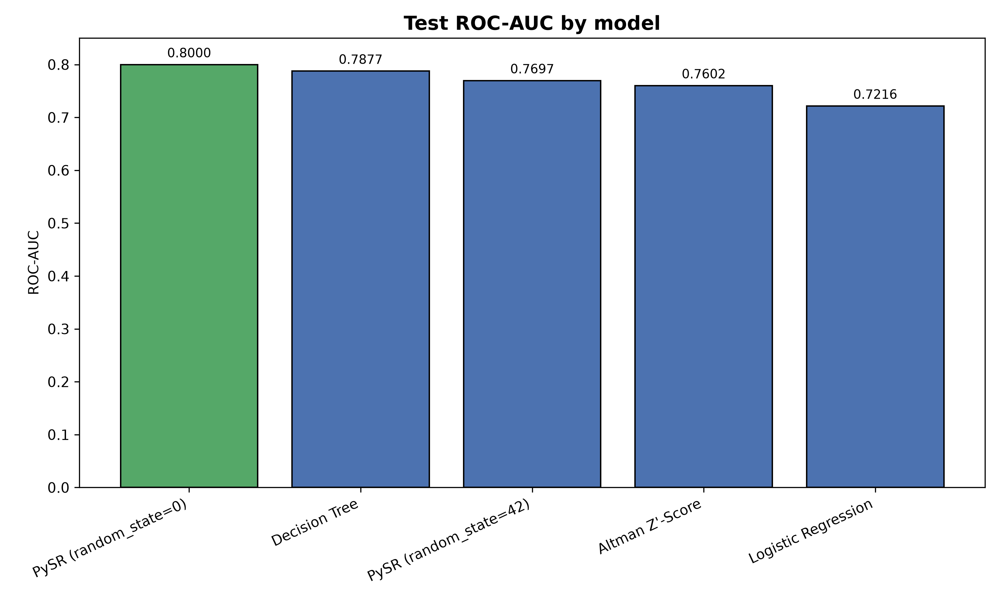
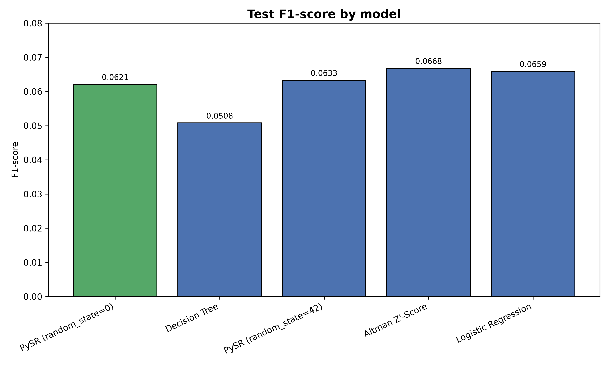
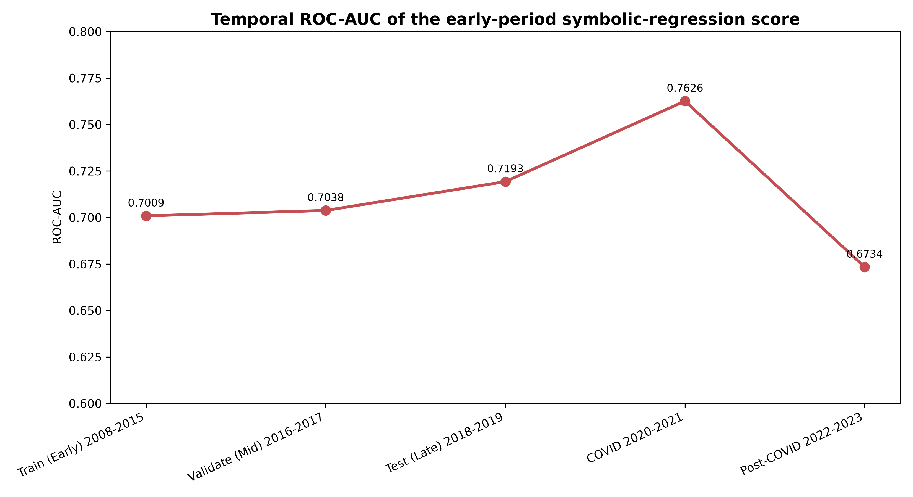
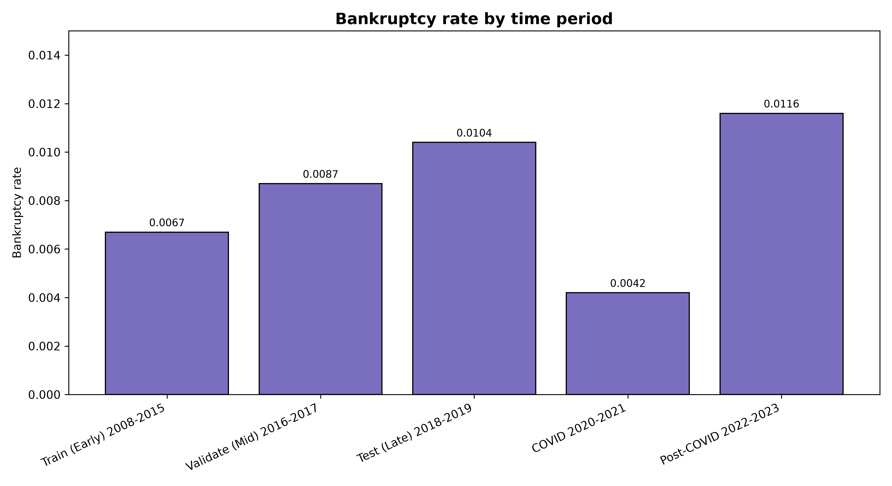

# Symbolic Regression for Bankruptcy Prediction

This project investigates whether symbolic regression can produce interpretable
nonlinear scoring functions for one-year corporate bankruptcy prediction. The
main experiment is implemented in
[`SR_Experiment_One.ipynb`](SR_Experiment_One.ipynb).

## What the experiment does

The notebook:

1. Downloads the `ttchopper/openfundex` dataset from Hugging Face.
2. Converts the train, validation, and test splits to pandas DataFrames.
3. Removes financial firms using the `is_financial` flag.
4. Predicts `target_bankrupt_1y` from accounting and financial-ratio features.
5. Drops features with more than 60% missing values, based on the training set.
6. Imputes missing values with training-set medians and clips outliers to
	training-set 1st and 99th percentiles.
7. Compares these models:
	- Altman Z'-Score
	- Balanced logistic regression
	- A balanced depth-3 decision tree
	- PySR symbolic regression with random states 0 and 42
8. Optimizes classification thresholds on validation data and reports test-set
	accuracy, precision, recall, F1, and ROC-AUC.
9. Measures equation compactness, variable-selection stability, and performance
	across economic periods from 2008 through 2023.

## Features

The initial feature set contains:

`debt_to_equity`, `current_ratio`, `roe`, `roa`, `gross_margin`,
`operating_margin`, `net_margin`, `f_score`, `z_prime_score`,
`cash_conversion_ratio`, `accrual_ratio`, `free_cash_flow_margin`,
`book_value_per_share`, `tangible_book_value_per_share`, and
`net_working_capital_per_share`.

The final set is determined at runtime after the training-set missingness
filter.

## Setup

Use Python 3.10 or newer and a working Julia installation. PySR uses Julia for
the symbolic-regression search.

```bash
git clone <repository-url>
cd SR_Bankruptcy
python -m venv .venv
source .venv/bin/activate       # macOS/Linux
python -m pip install --upgrade pip
pip install -r requirements.txt
pip install datasets scipy sympy jupyter
```

Then start Jupyter or open the notebook in VS Code:

```bash
jupyter notebook SR_Experiment_One.ipynb
```

The first notebook cell installs `datasets`. The PySR setup cell calls
`pysr.install(confirm=True)` to install the Julia-side dependencies. Depending
on the local Julia configuration, PySR may require additional setup; see the
[PySR installation guide](https://astroautomata.com/PySR/v1.5.9/installation/).

## Running the notebook

Run the cells from top to bottom in a fresh Python kernel. The dataset is
downloaded at runtime, so internet access is required on the first run.

The PySR searches are intentionally configured with serial parallelism and can
take substantially longer than the preprocessing and baseline-model cells.
The experiment uses 500 iterations for each full-data PySR run and 150
iterations for the early-period temporal run.

## Outputs

The notebook prints and displays:

- Dataset shapes before and after filtering
- Missingness and cleaned-data summaries
- A feature-correlation heatmap
- Baseline and symbolic-regression test metrics
- The best variable-containing equations in plain text and LaTeX
- Equation complexity and variable-selection overlap
- Chronological class distributions and temporal performance

PySR search artifacts are stored under [`outputs/`](outputs/), including
`hall_of_fame.csv` files for individual runs. These artifacts are useful for
reviewing the equations discovered during a search.

## Key result visualizations

The repository now includes generated figures under [`images/`](images/):









These plots summarize the main findings from the experiment: the strongest
ROC-AUC on the held-out test set is achieved by the best PySR model, while the
variable-overlap analysis suggests only partial stability across runs and time
periods.

## Interpretation notes

This is an experimental research notebook, not a production bankruptcy-risk
system. The discovered equations should be treated as candidate score
functions. In particular:

- Thresholds are selected using validation data, while final metrics are
  reported on test data.
- Preprocessing statistics are calculated from training data only.
- Temporal validation is preliminary and depends on the number of bankruptcies
  available in each period.
- Symbolic-regression equations can vary across random seeds and should be
  checked for economic plausibility, out-of-sample stability, and sensitivity
  to the search budget.

## Repository structure

```text
.
├── README.md
├── requirements.txt
├── SR_Experiment_One.ipynb
├── images/
│   ├── model_roc_auc.png
│   ├── model_f1_score.png
│   ├── temporal_roc_auc.png
│   └── bankruptcy_rate_by_period.png
├── outputs/
│   └── <run>/hall_of_fame.csv
└── generate_visuals.py
```
